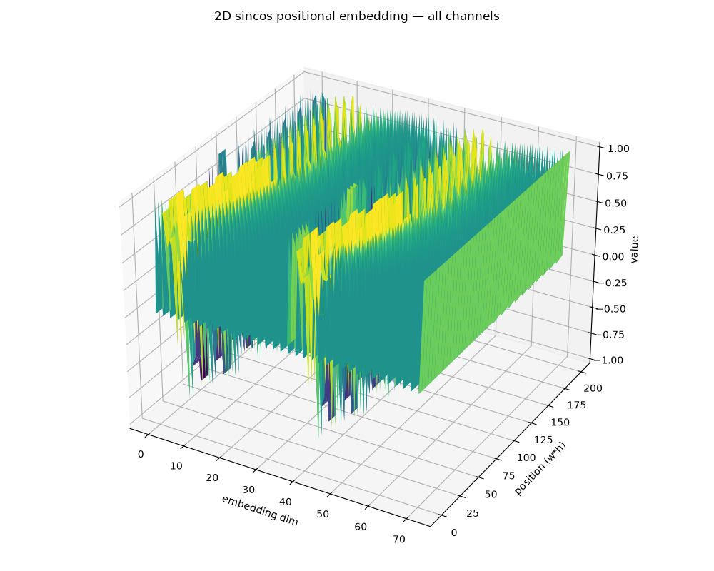
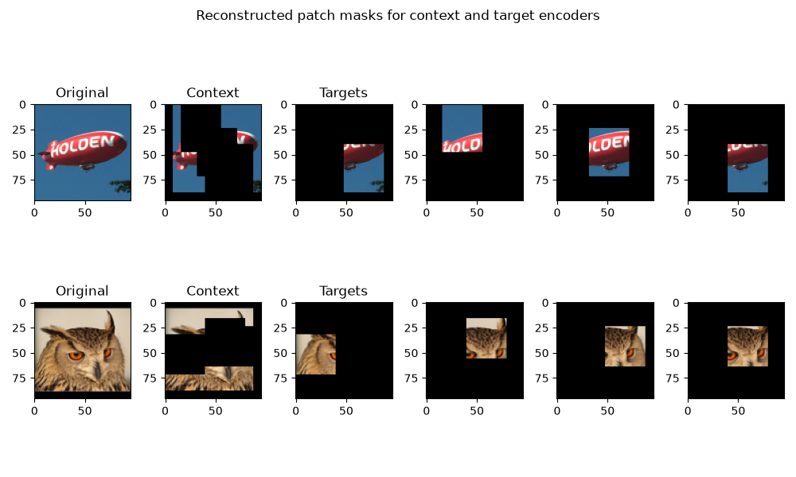

# I-JEPA Tinygrad port

> I like LeCunns JEPA paradigm, thought this would be the best model to start with from which I could see interesting results at a modest parameter size.

## Figures

> 2d grid sin-cos positional embedding example

> Replication of original figure form i-jepa paper, shows the result of reconstructing an image based on the masked patches from target and encoding masks. During the forward pass these masks are actually applied to the embedding vectors, not raw pixel values.

### Methodology

- Train encoders and predictor on the 100k unlabeled split from STL-10
- Train linear probe classifier on the 5000 image labelled split with frozen weights

### References:
- [Reference Code](https://github.com/facebookresearch/ijepa/)
- [Original paper](https://arxiv.org/pdf/2301.08243)
- [Dataset (STL-10)](https://cs.stanford.edu/~acoates/stl10/)
